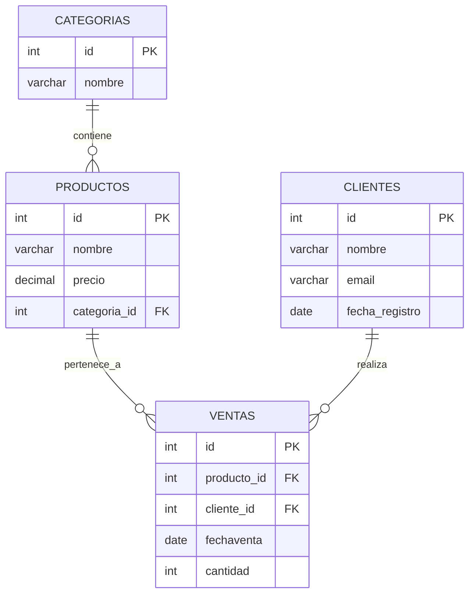

# Consultas SQL Avanzadas

## Introducción

A medida que las bases de datos se vuelven más complejas, se hace necesario dominar consultas SQL avanzadas para extraer y manipular información de manera eficiente. Las consultas avanzadas permiten realizar operaciones más sofisticadas, como subconsultas, combinaciones de tablas (`JOINs`), y el uso de funciones agregadas, lo que es esencial para el análisis de datos y la optimización del rendimiento de las bases de datos.

El dominio de estas técnicas es crucial para tareas como la generación de reportes, la minería de datos, y el análisis de grandes volúmenes de información, lo que en última instancia mejora la toma de decisiones en cualquier organización.

En este módulo, se utilizará un modelo de base de datos de ejemplo que representa una tienda de productos con diferentes categorías, ventas, y clientes. Este modelo se empleará para demostrar diversas técnicas avanzadas de SQL.

## Modelo ER de la Base de Datos



## Ejercicios de Consultas SQL Avanzadas

### Ejercicio 1: Listar productos y categorías

Listar todos los productos junto con sus respectivas categorías. Mostrar el nombre del producto y el nombre de la categoría.

```sql
SELECT p.nombre AS nombre_producto, c.nombre AS nombre_categoria
FROM productos p
INNER JOIN categorias c ON p.categoria_id = c.id;
```

### Ejercicio 2: Mostrar ventas por cliente

Mostrar todas las ventas realizadas por cada cliente. Incluir también los clientes que no han realizado ventas. Mostrar el nombre del cliente, la fecha de la venta y el nombre del producto.

```sql
SELECT cl.nombre AS nombre_cliente, v.fechaventa, p.nombre AS nombre_producto
FROM clientes cl
LEFT JOIN ventas v ON cl.id = v.cliente_id
LEFT JOIN productos p ON v.producto_id = p.id;
```

### Ejercicio 3: Mostrar categorías y productos

Mostrar todas las categorías junto con sus productos. Incluir también las categorías que no tienen productos asociados.

```sql
SELECT c.nombre AS nombre_categoria, p.nombre AS nombre_producto
FROM categorias c
LEFT JOIN productos p ON c.id = p.categoria_id;
```

### Ejercicio 4: Filtrar productos por precio

Listar todos los productos cuyo precio sea mayor al precio promedio de todos los productos.

```sql
SELECT nombre
FROM productos
WHERE precio > (SELECT AVG(precio) FROM productos);
```

### Ejercicio 5: Contar productos por categoría

Contar cuántos productos hay en cada categoría. Incluir también las categorías que no tienen productos.

```sql
SELECT c.nombre AS nombre_categoria, COUNT(p.id) AS total_productos
FROM categorias c
LEFT JOIN productos p ON c.id = p.categoria_id
GROUP BY c.nombre;
```

### Ejercicio 6: Mostrar clientes sin ventas

Listar todos los clientes que no han realizado ninguna venta.

```sql
SELECT nombre
FROM clientes cl
WHERE NOT EXISTS (SELECT 1 FROM ventas v WHERE v.cliente_id = cl.id);
```

### Ejercicio 7: Agrupar ventas por año

Mostrar el número total de ventas por año. Ordenar los resultados por año.

```sql
SELECT EXTRACT(YEAR FROM fechaventa) AS anio, COUNT(*) AS total_ventas
FROM ventas
GROUP BY anio
ORDER BY anio;
```

### Ejercicio 8: Mostrar ventas recientes

Listar todas las ventas realizadas en el último mes. Mostrar el nombre del producto, el nombre del cliente y la fecha de la venta.

```sql
SELECT p.nombre AS nombre_producto, cl.nombre AS nombre_cliente, v.fechaventa
FROM ventas v
INNER JOIN productos p ON v.producto_id = p.id
INNER JOIN clientes cl ON v.cliente_id = cl.id
WHERE fechaventa >= NOW() - INTERVAL '1 month';
```

### Ejercicio 9: Calcular ingresos por categoría

Calcular los ingresos totales generados por cada categoría de productos. Mostrar el nombre de la categoría y el ingreso total.

```sql
SELECT c.nombre AS nombre_categoria, SUM(p.precio * v.cantidad) AS ingreso_total
FROM ventas v
INNER JOIN productos p ON v.producto_id = p.id
INNER JOIN categorias c ON p.categoria_id = c.id
GROUP BY c.nombre;
```

### Ejercicio 10: Clasificar productos por precio

Clasificar los productos en tres categorías: 'Bajo', 'Medio', y 'Alto', según su precio. Mostrar el nombre del producto y su categoría de precio.

```sql
SELECT nombre,
       CASE
           WHEN precio < 100 THEN 'Bajo'
           WHEN precio BETWEEN 100 AND 500 THEN 'Medio'
           ELSE 'Alto'
       END AS categoria_precio
FROM productos;
```

### Ejercicio 11: Formatear fechas de venta

Formatear la fecha de venta para mostrar solo el mes y el año.

```sql
SELECT TO_CHAR(fechaventa, 'MM-YYYY') AS mes_anio_venta
FROM ventas;
```

### Ejercicio 12: Subconsulta en cláusula FROM

Calcular el promedio de precios de productos, agrupados por categoría.

```sql
SELECT categoria, AVG(precio_promedio)
FROM (
    SELECT c.nombre AS categoria, AVG(p.precio) AS precio_promedio
    FROM productos p
    INNER JOIN categorias c ON p.categoria_id = c.id
    GROUP BY c.nombre
) AS sub
GROUP BY categoria;
```

## Resumen

Este conjunto de ejercicios cubre subconsultas, combinaciones de tablas, funciones agregadas, y otras técnicas avanzadas en SQL. Estos conceptos son fundamentales para cualquier profesional que necesite trabajar con bases de datos de manera eficiente, permitiendo extraer y analizar datos complejos para generar reportes y tomar decisiones informadas.
